# Example music

Twelve pieces across genres — from a one-finger melody to full multi-layer arrangements — doubling as format documentation for any agent that generates music. **Click any waveform to listen** (GitHub opens the MP3 with a player). Previews are synthesized straight from the JSON by `scripts/render-previews.mjs`, so what you hear is exactly what the MIDI plays; GarageBand's instruments sound far better.

For end-to-end recipes — importing MIDI from the internet, layering Apple Loops, Freesound textures — see **[workflows.md](workflows.md)**.

## Full arrangements

| Listen | Piece |
|---|---|
| [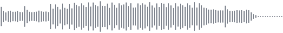](audio/edm-anthem.mp3) | **Neon Skyline** · [`edm-anthem.json`](edm-anthem.json) · 128 BPM, 5 layers<br>EDM: intro pads → build with accelerating snare roll + riser → drop with bass groove and lead hook → fall + ritardando outro |
| [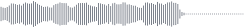](audio/jazz-swing.mp3) | **Blue Hour** · [`jazz-swing.json`](jazz-swing.json) · 140 BPM, 3 layers<br>Swing: spang-a-lang ride, brush ghosts, walking ii-V-I-VI bass, Charleston comping — swung 8ths placed off-grid at +0.67 |
| [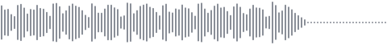](audio/acid-techno.mp3) | **Voltage Corridor** · [`acid-techno.json`](acid-techno.json) · 130 BPM, 3 layers<br>Acid techno: 303-style riff with a **CC74 filter-cutoff ramp** opening and closing across the bars — expression events in action |
| [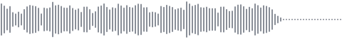](audio/latin-groove.mp3) | **Calle Ocho** · [`latin-groove.json`](latin-groove.json) · 100 BPM, 3 layers<br>Afro-Cuban: 3-2 son clave, cowbell, conga tumbao, anticipated bass, piano montuno — interlocking syncopation |
| [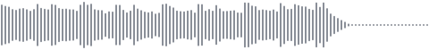](audio/rock-anthem.mp3) | **Stadium Lights** · [`rock-anthem.json`](rock-anthem.json) · 120 BPM, 4 layers<br>Rock: E-C-G-D power-chord chug with accent structure, locked bass, snare-into-toms fill, anthem melody |
| [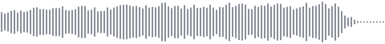](audio/ambient-dawn.mp3) | **First Light** · [`ambient-dawn.json`](ambient-dawn.json) · 60 BPM, 4 layers<br>Ambient: drone, overlapping suspended pads, sparse piano, shimmer arpeggio — everything at velocity 34-52 |
| [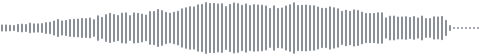](audio/cinematic-swell.mp3) | **Dawn Over Ice** · [`cinematic-swell.json`](cinematic-swell.json) · 70 BPM, 4 layers<br>Cinematic strings: swelling bows, rising theme with accelerando, timpani roll into the climax, ritardando resolution |
| [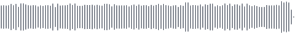](audio/bach-prelude.mp3) | **Prelude in C (BWV 846)** · [`bach-prelude.json`](bach-prelude.json) · 60 BPM, 2 layers<br>J.S. Bach, imported from the [Mutopia Project](https://www.mutopiaproject.org) (public domain) with `gb_import_midi` and saved as-is — two hands, two layers |

## Single sequences

| Listen | Piece |
|---|---|
| [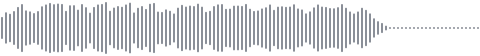](audio/twinkle.mp3) | **Twinkle Twinkle** · [`twinkle.json`](twinkle.json) — the "hello world" test |
| [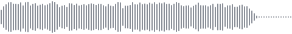](audio/lofi-chords.mp3) | **Lo-fi chords** · [`lofi-chords.json`](lofi-chords.json) — Fmaj7–Em7–Dm7–Cmaj7 at 72 BPM |
| [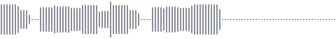](audio/funk-bassline.mp3) | **Funk bassline** · [`funk-bassline.json`](funk-bassline.json) — syncopated C-minor groove |
| [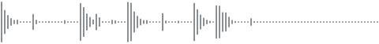](audio/drum-groove.mp3) | **Drum groove** · [`drum-groove.json`](drum-groove.json) — two-bar boom-bap beat |

## Try one without an MCP client

Build first (`npm install && npm run build`), open GarageBand with a software-instrument track selected, then:

```bash
node examples/play.mjs examples/jazz-swing.json
```

- Multi-layer songs play as a full mix on the selected instrument (GarageBand routes live MIDI to one track).
- `--layer bass` plays just that layer; `--record --layer drums` records it into the project.
- **To build the real arrangement**: for each layer — add a track (`gb_add_software_instrument_track`), give it its instrument (`gb_set_track_instrument`, e.g. "Drum Kit", "Fingerstyle Bass", "Cinematic"), then record (`gb_record_sequence`). Set the instrument *before* recording.

## Format

A **sequence** is `tempo` + `events` on a beat grid — what `gb_play_sequence` / `gb_record_sequence` take. A **song** adds `layers` and an optional `tempoMap` — what `gb_play_song` takes.

```json
{
  "tempo": 128,
  "tempoMap": [
    { "beat": 32, "bpm": 128 },
    { "beat": 40, "bpm": 92, "ramp": true }
  ],
  "layers": [
    {
      "name": "drums",
      "channel": 10,
      "events": [
        { "note": "kick", "startBeat": 0, "durationBeats": 0.5, "velocity": 110 },
        { "note": "openhat", "startBeat": 0.5, "durationBeats": 0.4 }
      ]
    },
    {
      "name": "acid bass",
      "channel": 2,
      "events": [
        { "note": "C2", "startBeat": 0, "durationBeats": 0.2, "velocity": 112 },
        { "cc": { "controller": 74, "value": 25, "endValue": 120 }, "startBeat": 0, "durationBeats": 8 }
      ]
    }
  ]
}
```

- `note` — a name (`"C4"`, `"F#3"`, `"Bb2"`), a drum alias (`kick`, `snare`, `hihat`, `openhat`, `clap`, `crash`, `ride`, `rimshot`, `cowbell`, `tomlow`, …), or a raw MIDI number 0–127
- `notes` — several notes at once (a chord)
- `cc` / `bend` — expression instead of a note: control-change or pitch-bend, with `endValue` for a linear ramp across `durationBeats` (filter sweeps, swells, pitch drops)
- `startBeat` / `durationBeats` — position and length in beats; fractions welcome (`0.25` = sixteenth; `0.67` = a swung "and")
- `velocity` — 1–127, default 100; ramp it across notes for crescendos, builds, and risers
- `tempoMap` — tempo changes at beats; `"ramp": true` glides linearly from the previous tempo, arriving at that beat. To ramp only near the end, pin the old tempo first, as above
- `layers` — named parts, each with a default MIDI `channel`

Musical devices used across the examples, all expressible with plain events: **riser** (ascending 16ths, velocity ramping up — EDM anthem), **fall** (the reverse), **build roll** (snare 8ths→16ths), **swell** (repeated bows, stepped velocity — cinematic), **filter sweep** (CC74 ramp — acid techno), **swing** (8th pairs at +0.67 — jazz), **clave & montuno** (interlocked syncopation — latin), **accent chug** (velocity-patterned 8ths — rock).
